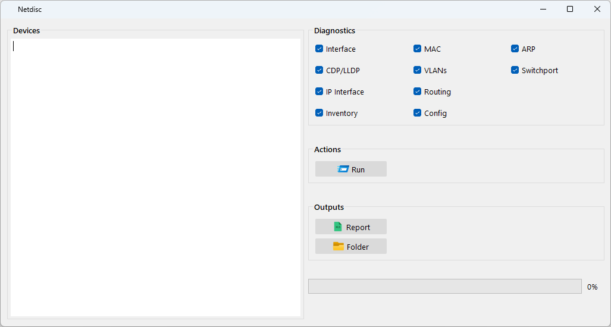

# Netdisc

## Overview  
**Netdisc** is a network discovery tool used to generate a discovery report for a given set of devices. It collects various port diagnostics based on user selection and provides details for discovered interfaces across different network layers.  

## Features  
- **Layer 1**: Status, Duplex, Speed, Cable type, Description  
- **Layer 2**: MAC, VLANs, CDP, Trunking  
- **Layer 3**: ARP, Reachability, SVI, Protocols  
- **Configuration**: Running configuration of devices  

## Migration Lifecycle
- Discovery
- Pre-Migration 
- Post-Migration

## Usage  
- Add the network devices to be scanned.  
- Check the required diagnostics options (e.g., Interface, MAC, VLANs, etc.).  
- Click the "Run" button to start discovery.  
- Access reports through the "Report" or "Folder" options.  

## Tags  
`#NetworkDiscovery` `#Netmig` `#Automation` `#NetworkMigration` `#Diagnostics` `#Cisco` `#Infrastructure` `#ARP` `#VLAN` `#CDP` `#LLDP` `#MAC` `#Routing` `#ConfigManagement`

## Screenshots
